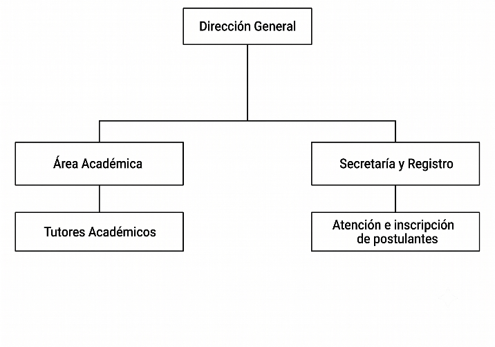

> **FACULTAD DE INGENIERÍA**

**CARRERA DE INGENIERÍA EN SISTEMAS**

**“SISTEMA WEB DE EVALUACIÓN Y SEGUIMIENTO ACADÉMICO PARA OPTIMIZAR EL
MONITOREO DEL DESEMPEÑO DE POSTULANTES PREUNIVERSITARIOS MEDIANTE
LEARNING ANALYTICS, TEORÍA DE RESPUESTA AL ÍTEM Y MODELOS
PREDICTIVOS.”**

**CASO:** ACADEMIA UNIVERSITARIA AVALANCHA

**CASO:** CENTRO DEL ADULTO MAYOR “CASA AMANDITA”

**POSTULANTE:** CLAROS MAMANI VICENTE OSCAR

> **DOCENTE:** ING. CUELLAR SONCO ALAN JUANCARLOS CARLOS

**LA PAZ – BOLIVIA**

**2026**

> **ÍNDICE GENERAL**

[I. INTRODUCCIÓN [1](#introducción)](#introducción)

[1.1. PRESENTACIÓN DEL PROBLEMA DE INVESTIGACIÓN
[3](#presentación-del-problema-de-investigación)](#presentación-del-problema-de-investigación)

[1.2. ANTECEDENTES [4](#antecedentes)](#antecedentes)

[1.2.1. ANTECEDENTES DE LA INSTITUCIÓN
[4](#antecedentes-de-la-institución)](#antecedentes-de-la-institución)

[1.2.1.1. MISIÓN [5](#misión)](#misión)

[1.2.1.2. VISIÓN [5](#visión)](#visión)

[1.2.1.3. ORGANIGRAMA DE LA INSTITUCIÓN
[6](#organigrama-de-la-institución)](#organigrama-de-la-institución)

[1.2.2. ANTECEDENTES DEL PROBLEMA
[6](#antecedentes-del-problema)](#antecedentes-del-problema)

[1.2.3. ANTECEDENTES DEL PROYECTO DE INVESTIGACIÓN
[8](#antecedentes-del-proyecto-de-investigación)](#antecedentes-del-proyecto-de-investigación)

[1.3. ARGUMENTACION DE LA IMPORTANCIA DEL OBJETO DE ESTUDIO
[10](#argumentacion-de-la-importancia-del-objeto-de-estudio)](#argumentacion-de-la-importancia-del-objeto-de-estudio)

[1.4. NOVEDAD CIENTÍFICA [11](#novedad-científica)](#novedad-científica)

[II. DESARROLLO [13](#desarrollo)](#desarrollo)

[CAPÍTULO 2. [14](#capítulo-2.)](#capítulo-2.)

[JUSTIFICACIÓN DEL PROYECTO
[14](#justificación-del-proyecto)](#justificación-del-proyecto)

[2.1. JUSTIFICACIÓN TÉCNICA
[15](#justificación-técnica)](#justificación-técnica)

[2.2. JUSTIFICACIÓN ECONÓMICA
[16](#justificación-económica)](#justificación-económica)

[2.3. JUSTIFICACIÓN SOCIAL
[18](#justificación-social)](#justificación-social)

[2.4. JUSTIFICACIÓN LEGAL
[18](#justificación-legal)](#justificación-legal)

[CAPÍTULO 3. [20](#capítulo-3.)](#capítulo-3.)

[DISEÑO TEÓRICO DE LA INVESTIGACIÓN
[20](#diseño-teórico-de-la-investigación)](#diseño-teórico-de-la-investigación)

[3.1. PROBLEMÁTICA [21](#problemática)](#problemática)

[3.2. FORMULACIÓN DEL PROBLEMA
[22](#formulación-del-problema)](#formulación-del-problema)

[3.3. DELIMITACIÓN DE CONTENIDO
[22](#delimitación-de-contenido)](#delimitación-de-contenido)

[3.3.1. LÍMITES [23](#límites)](#límites)

[3.3.2. ALCANCES [24](#alcances)](#alcances)

[3.4. DELIMITACIÓN TEMPORAL
[24](#delimitación-temporal)](#delimitación-temporal)

[3.5. DELIMITACIÓN ESPACIAL
[25](#delimitación-espacial)](#delimitación-espacial)

[3.6. OBJETIVOS [25](#objetivos)](#objetivos)

[3.6.1. OBJETIVO GENERAL [25](#objetivo-general)](#objetivo-general)

[3.6.2. OBJETIVOS ESPECÍFICOS
[25](#objetivos-específicos)](#objetivos-específicos)

[3.7. POBLACIÓN [26](#población)](#población)

[3.8. MÉTODO DE MUESTREO [27](#método-de-muestreo)](#método-de-muestreo)

[3.9. MUESTRA [27](#muestra)](#muestra)

[CAPÍTULO 4. [30](#_Toc225185167)](#_Toc225185167)

[DISEÑO O DISPOSITIVO DE PRUEBA
[30](#diseño-o-dispositivo-de-prueba)](#diseño-o-dispositivo-de-prueba)

[CAPÍTULO 5. [32](#capítulo-5.)](#capítulo-5.)

[DESARROLLO DEL PROYECTO
[32](#desarrollo-del-proyecto)](#desarrollo-del-proyecto)

[5.1. INTRODUCCIÓN A LA METODOLOGÍA DE ANÁLISIS SCRUM
[33](#introducción-a-la-metodología-de-análisis-scrum)](#introducción-a-la-metodología-de-análisis-scrum)

[5.2. FASE 1 – PRE GAME [34](#fase-1-pre-game)](#fase-1-pre-game)

[5.2.1. ANALISIS Y REQUERIMIENTOS
[34](#análisis-y-requerimientos)](#análisis-y-requerimientos)

[5.2.2. HISTORIAS DE USUARIO [36](#_Toc225185174)](#_Toc225185174)

[5.2.3. PRODUCT BACKLOG [37](#product-backlog)](#product-backlog)

[5.2.4. SPRINT BACKLOG [38](#sprint-backlog)](#sprint-backlog)

[5.3. FASE 2 – GAME [39](#fase-2-game)](#fase-2-game)

[5.3.1. ANÁLISIS Y DISEÑO [39](#análisis-y-diseño)](#análisis-y-diseño)

[5.3.1.1. DIAGRAMAS DE PAQUETES
[39](#diagramas-de-paquetes)](#diagramas-de-paquetes)

[5.3.1.2. DIAGRAMAS DE CASOS DE USO
[40](#diagramas-de-casos-de-uso)](#diagramas-de-casos-de-uso)

[5.3.1.3. DIAGRAMAS DE SECUENCIA [45](#_Toc225185181)](#_Toc225185181)

[5.3.1.4. DIAGRAMAS DE COLABORACIÓN
[49](#diagramas-de-colaboración)](#diagramas-de-colaboración)

[5.3.1.5. DIAGRAMAS DE CLASES DE ALTO NIVEL
[51](#diagramas-de-clases-de-alto-nivel)](#diagramas-de-clases-de-alto-nivel)

[5.3.1.6. DIAGRAMAS DE CLASES DE BAJO NIVEL
[52](#diagramas-de-clases-de-bajo-nivel)](#diagramas-de-clases-de-bajo-nivel)

[5.3.1.7. DIAGRAMA FÍSICO [53](#diagrama-físico)](#diagrama-físico)

[5.3.1.8. MAPA NAVEGACIONAL DEL SISTEMA
[54](#mapa-navegacional-del-sistema)](#mapa-navegacional-del-sistema)

[5.3.1.9. ARQUITECTURA DE SOFTWARE.
[55](#arquitectura-de-software.)](#arquitectura-de-software.)

[III. CONCLUSIONES [56](#conclusiones)](#conclusiones)

[IV. RECOMENDACIONES [58](#recomendaciones)](#recomendaciones)

[I. RECOMENDACIONES [59](#recomendaciones-1)](#recomendaciones-1)

[V. GLOSARIO [60](#glosario)](#glosario)

[VI. WEBGRAFÍA [64](#webgrafía)](#webgrafía)

[VII. ANEXOS [66](#anexos)](#anexos)

[ANEXO A. ENTREVISTA [67](#anexo-a.-entrevista)](#anexo-a.-entrevista)

[A.1. Preguntas [67](#a.1.-preguntas)](#a.1.-preguntas)

[A.2. Resultados [67](#a.2.-resultados)](#a.2.-resultados)

[A.3. Interpretación de la entrevista
[67](#a.3.-interpretación-de-la-entrevista)](#a.3.-interpretación-de-la-entrevista)

[ANEXO B. CUESTIONARIO [68](#anexo-b.-encuesta)](#anexo-b.-encuesta)

[B. 1. Preguntas [68](#b.-1.-preguntas)](#b.-1.-preguntas)

[B.2. Resultados del Cuestionario
[68](#b.2.-resultados-del-cuestionario)](#b.2.-resultados-del-cuestionario)

[B.3. Interpretación [68](#_Toc225181107)](#_Toc225181107)

[ANEXO C. OBSERVACIÓN
[69](#anexo-c.-observación)](#anexo-c.-observación)

[C.1. Indicadores observables
[69](#c.1.-indicadores-observables)](#c.1.-indicadores-observables)

[C.2. Resultados simulados de la observación
[69](#c.2.-resultados-simulados-de-la-observación)](#c.2.-resultados-simulados-de-la-observación)

[C.3. Interpretación de la observación
[70](#c.3.-interpretación-de-la-observación)](#c.3.-interpretación-de-la-observación)

**ÍNDICE DE TABLAS**

[**TABLA 1:** SISTEMA DE ANALÍTICA EDUCATIVA PARA LA PREDICCIÓN DEL
RENDIMIENTO ACADÉMICO [8](#_Toc228981629)](#_Toc228981629)

[**TABLA 2:** PLATAFORMA DE ANALÍTICA DE APRENDIZAJE PARA EL SEGUIMIENTO
DEL DESEMPEÑO ACADÉMICO [8](#_Toc228981630)](#_Toc228981630)

[**TABLA 3:** LEARNING ANALYTICS FOR PREDICTING STUDENT PERFORMANCE IN
MATHEMATICS EDUCATION [9](#_Toc228981631)](#_Toc228981631)

[**TABLA 4:** PREDICTIVE LEARNING ANALYTICS IN PRE-UNIVERSITY
MATHEMATICS EDUCATION [9](#_Toc228981632)](#_Toc228981632)

[**TABLA 5:** UTILIZING LEARNING ANALYTICS TO PREDICT STUDENT
PERFORMANCE IN DIGITAL LEARNING ENVIRONMENTS
[10](#_Toc228981633)](#_Toc228981633)

[**TABLA 6:** REQUERIMIENTO FUNCIONALES
[34](#_Toc228981634)](file:///C:\Users\proom\Downloads\Claros_Mamani_Vicente_PH3.docx#_Toc228981634)

[**TABLA 7:** REQUERIMIENTOS NO FUNCIONALES
[35](#_Toc228981635)](file:///C:\Users\proom\Downloads\Claros_Mamani_Vicente_PH3.docx#_Toc228981635)

[**TABLA 8:** HISTORIAS DE USUARIO [36](#_Toc228981636)](#_Toc228981636)

[**TABLA 9:** PRODUCT BACKLOG
[37](#_Toc228981637)](file:///C:\Users\proom\Downloads\Claros_Mamani_Vicente_PH3.docx#_Toc228981637)

[**TABLA 10:** SPRINT BACKLOG
[38](#_Toc228981638)](file:///C:\Users\proom\Downloads\Claros_Mamani_Vicente_PH3.docx#_Toc228981638)

[**TABLA 11:** CASOS DE USO REGISTRO DE SESIONES
[40](#_bookmark40)](#_bookmark40)

[**TABLA 12:** CASO DE USO ADMINISTRACIÓN
[41](#_Toc228981640)](#_Toc228981640)

[**TABLA 13:** CASO DE USO MODULO DE RETOS
[42](#_bookmark43)](#_bookmark43)

[**TABLA 14:** CASO DE USO MÓDULO DE REPORTES
[43](#_bookmark44)](#_bookmark44)

[**TABLA 15:** CASO DE USO MÓDULO DE SEGURIDAD
[44](#_Toc228981643)](#_Toc228981643)

**  
**

**ÍNDICE DE ILUSTRACION**

[**ILUSTRACIÓN 1:** ESTRUCTURA ORGANIZACIONAL
[6](#_Toc228981644)](file:///C:\Users\proom\Downloads\Claros_Mamani_Vicente_PH3.docx#_Toc228981644)

[**ILUSTRACIÓN 2:** FÓRMULA DE TAMAÑO DE MUESTRA PARA POBLACIONES
FINITAS [28](#_Toc228981645)](#_Toc228981645)

[**ILUSTRACIÓN 3:** DIAGRAMA DE PAQUETES DEL SISTEMA
[39](#_Toc228981646)](#_Toc228981646)

[**ILUSTRACIÓN 4:** DIAGRAMA DE CASO DE USO REGISTRO DE SESIONES
[40](#_Toc228981647)](#_Toc228981647)

[**ILUSTRACIÓN 5:** DIAGRAMA DE CASO DE USO ADMINISTRACIÓN
[41](#_Toc228981648)](#_Toc228981648)

[**ILUSTRACIÓN 6:** DIAGRAMA DE CASO DE USO MÓDULO DE RETOS
[42](#_Toc228981649)](#_Toc228981649)

[**ILUSTRACIÓN 7:** DIAGRAMA CASO DE USO MODULO DE REPORTES
[43](#_Toc228981650)](#_Toc228981650)

[**ILUSTRACIÓN 8:** DIAGRAMA DE CASO DE USO MODULO DE SEGURIDAD
[44](#_Toc228981651)](#_Toc228981651)

[**ILUSTRACIÓN 9:** DIAGRAMA DE SECUENCIA INICIO DE SESIÓN
[45](#_Toc228981652)](file:///C:\Users\proom\Downloads\Claros_Mamani_Vicente_PH3.docx#_Toc228981652)

[**ILUSTRACIÓN 10:** DIAGRAMA DE SECUENCIA MÓDULO DE RETOS
[46](#_Toc228981653)](file:///C:\Users\proom\Downloads\Claros_Mamani_Vicente_PH3.docx#_Toc228981653)

[**ILUSTRACIÓN 11:** DIAGRAMA DE SECUENCIA MÓDULO DE REPORTES
[47](#_Toc228981654)](file:///C:\Users\proom\Downloads\Claros_Mamani_Vicente_PH3.docx#_Toc228981654)

[**ILUSTRACIÓN 12:** DIAGRAMA DE SECUENCIA MÓDULO DE ADMINISTRACIÓN
[48](#_Toc228981655)](file:///C:\Users\proom\Downloads\Claros_Mamani_Vicente_PH3.docx#_Toc228981655)

[**ILUSTRACIÓN 13:** DIAGRAMA DE SECUENCIA MÓDULO DE EVALUACIÓN
[48](#_Toc228981656)](file:///C:\Users\proom\Downloads\Claros_Mamani_Vicente_PH3.docx#_Toc228981656)

[**ILUSTRACIÓN 14:** DIAGRAMA DE COLABORACIÓN DOCENTE
[49](#_Toc228981657)](file:///C:\Users\proom\Downloads\Claros_Mamani_Vicente_PH3.docx#_Toc228981657)

[**ILUSTRACIÓN 15:** DIAGRAMA DE COLABORACIÓN ADMINISTRADOR
[50](#_Toc228981658)](file:///C:\Users\proom\Downloads\Claros_Mamani_Vicente_PH3.docx#_Toc228981658)

[**ILUSTRACIÓN 16:** DIAGRAMA DE COLABORACIÓN ESTUDIANTE
[50](#_Toc228981659)](file:///C:\Users\proom\Downloads\Claros_Mamani_Vicente_PH3.docx#_Toc228981659)

[**ILUSTRACIÓN 17:** DIAGRAMA DE CLASE DE ALTO NIVEL
[51](#_Toc228981660)](#_Toc228981660)

[**ILUSTRACIÓN 18:** DIAGRAMA DE CLASE DE BAJO NIVEL
[52](#_Toc228981661)](file:///C:\Users\proom\Downloads\Claros_Mamani_Vicente_PH3.docx#_Toc228981661)

[**ILUSTRACIÓN 19:** DIAGRAMA FÍSICO
[53](#_Toc228981662)](file:///C:\Users\proom\Downloads\Claros_Mamani_Vicente_PH3.docx#_Toc228981662)

[**ILUSTRACIÓN 20:** MAPA NAVEGACIONAL
[54](#_Toc228981663)](file:///C:\Users\proom\Downloads\Claros_Mamani_Vicente_PH3.docx#_Toc228981663)

# INTRODUCCIÓN

> **  
> **

1.  **INTRODUCCIÓN**

Durante los últimos años, la transición entre la educación secundaria y
la educación

Ingresar a la universidad representa para muchos bachilleres una meta
importante, pero también un momento de alta exigencia académica. En
carreras como Ingeniería, esta transición suele evidenciar diferencias
entre los conocimientos adquiridos en la etapa escolar y el nivel
requerido en los procesos de admisión. Por ello, la preparación
preuniversitaria se ha convertido en un apoyo necesario para reforzar
contenidos, fortalecer el razonamiento y brindar mayor seguridad a los
postulantes que buscan continuar su formación profesional.

En este contexto, la preparación o acompañamiento académico mediante
clases, prácticas, simulacros y actividades de nivelación en áreas
fundamentales como Matemática, Física y Química se volvieron
imprescindibles. Sin embargo, conocer únicamente una calificación final
no siempre permite comprender el verdadero avance del postulante ni las
dificultades específicas que enfrenta durante su preparación. Más allá
de aprobar o reprobar una práctica, resulta importante identificar en
qué contenidos existe mayor debilidad, cómo evoluciona el rendimiento y
qué aspectos requieren mayor atención por parte de los tutores.

Con base en esta necesidad, se propone el desarrollo de una plataforma
académica orientada a evaluar, analizar y predecir el desempeño de
postulantes preuniversitarios. La solución busca organizar evaluaciones,
resultados y reportes académicos para transformar los datos del proceso
formativo en información útil para la toma de decisiones. De esta
manera, el proyecto pretende fortalecer el seguimiento académico y
apoyar una nivelación más precisa para postulantes orientados a carreras
de Ingeniería.

## PRESENTACIÓN DEL PROBLEMA DE INVESTIGACIÓN

La preparación académica de los postulantes que buscan ingresar a la
educación superior representa una etapa importante dentro del proceso
formativo, especialmente cuando se orienta a carreras de alta exigencia
como las ingenierías. En este contexto, las áreas de Matemática, Física
y Química cumplen un papel fundamental, debido a que constituyen la base
de muchos contenidos evaluados en pruebas de ingreso, dispensaciones y
cursos preuniversitarios. Sin embargo, una parte de los bachilleres que
concluyen la educación secundaria presenta dificultades para afrontar
este nivel de exigencia, principalmente por vacíos en contenidos
previos, debilidades en razonamiento lógico, limitada práctica en
resolución de problemas y poca familiaridad con evaluaciones de mayor
complejidad académica.

Esta situación genera la necesidad de procesos de nivelación
preuniversitaria, donde los postulantes refuercen conocimientos,
desarrollen habilidades analíticas y se preparen para responder a las
exigencias de la educación superior. En instituciones de preparación
preuniversitaria, el seguimiento del desempeño académico se vuelve
relevante porque permite observar el avance de los postulantes en
asignaturas clave y reconocer las áreas donde requieren mayor apoyo. No
obstante, cuando el rendimiento se revisa únicamente a partir de
resultados generales o calificaciones finales, se dificulta comprender
con precisión las debilidades académicas existentes en Matemática,
Física y Química. Por ello, el problema de investigación se relaciona
con la necesidad de comprender el desempeño académico de los postulantes
en estas áreas fundamentales, dentro del contexto de preparación para el
ingreso a carreras de Ingeniería.

## ANTECEDENTES

### ANTECEDENTES DE LA INSTITUCIÓN

La Academia Universitaria Avalancha, identificada comercialmente como
Avalancha Tu Academia, es una institución de educación no formal
dedicada a la preparación académica preuniversitaria de postulantes que
buscan ingresar a la educación superior. La institución desarrolla sus
actividades en la ciudad de La Paz, Bolivia, con sede ubicada en la
calle Juan de la Riva N.° 1458-B, entre las calles Loayza y Bueno, en
una zona céntrica y accesible para estudiantes y bachilleres que
requieren apoyo académico complementario. Su presencia institucional se
encuentra orientada a la preparación intensiva, nivelación de
conocimientos y acompañamiento académico para procesos de admisión
universitaria.

La academia se desenvuelve dentro del rubro educativo preuniversitario,
brindando cursos y programas de preparación dirigidos a postulantes
interesados en áreas de alta demanda académica, entre ellas Ingeniería,
Ciencias Económicas, Ciencias de la Salud, Medicina, Odontología,
Bioquímica, áreas militares y policiales, además de cursos de nivelación
secundaria. Su actividad principal se centra en reforzar conocimientos
previos, desarrollar habilidades de razonamiento, fortalecer capacidades
lógico-matemáticas y preparar a los postulantes para pruebas de ingreso,
dispensaciones, Pruebas de Suficiencia Académica y otros procesos
relacionados con el acceso a universidades.

En su trayectoria institucional, Avalancha se ha consolidado como una
alternativa de apoyo académico para postulantes que requieren
preparación adicional antes de iniciar estudios superiores. Su labor
responde a una necesidad frecuente en el contexto preuniversitario,
donde muchos bachilleres buscan reforzar contenidos, adaptarse al nivel
de exigencia de las pruebas de admisión y mejorar su desempeño en áreas
fundamentales. Por ello, la institución cumple un papel complementario
dentro del proceso educativo, al acompañar la transición entre la
educación secundaria y la formación universitaria mediante clases
presenciales, material de estudio, prácticas evaluativas y orientación
académica.

#### MISIÓN

Brindar preparación académica preuniversitaria de calidad, orientada al
fortalecimiento de conocimientos, habilidades lógico-matemáticas y
capacidades de razonamiento de los postulantes, mediante procesos de
enseñanza, acompañamiento académico, práctica evaluativa y orientación
formativa que contribuyan a mejorar sus condiciones de ingreso a la
educación superior.

#### VISIÓN

Ser una academia preuniversitaria reconocida por su calidad académica,
organización institucional y capacidad de acompañar a los postulantes en
su preparación para la educación superior, promoviendo el desarrollo de
habilidades intelectuales, disciplina de estudio, orientación académica
pertinente y mejora continua del rendimiento académico.

#### VALORES INSTITUCIONALES

La Academia Universitaria Avalancha orienta sus actividades educativas
bajo valores relacionados con la responsabilidad académica, el
compromiso con el aprendizaje, la disciplina, la superación personal, el
respeto, la orientación al logro y la mejora continua. Estos valores
fortalecen el ambiente formativo de la institución y acompañan el
proceso de preparación de los postulantes hacia la educación superior.

#### ORGANIGRAMA DE LA INSTITUCIÓN

**ILUSTRACIÓN 1:**
ESTRUCTURA ORGANIZACIONAL

**FUENTE:** ELABORACIÓN PROPIA

### ANTECEDENTES DEL PROBLEMA

La diferencia entre la formación recibida en la educación secundaria y
las exigencias académicas de ingreso a la educación superior se ha
mantenido como una dificultad recurrente para muchos bachilleres que
buscan continuar estudios universitarios. Esta situación se hace más
visible en carreras de alta demanda y exigencia, como las ingenierías,
donde los procesos de admisión requieren conocimientos sólidos en
Matemática, Física y Química. A lo largo del tiempo, estas asignaturas
han representado una base fundamental para el desempeño académico
universitario, debido a que permiten desarrollar razonamiento lógico,
análisis de problemas, interpretación de fenómenos y aplicación de
procedimientos cuantitativos. Sin embargo, una parte de los postulantes
llega a la etapa preuniversitaria con vacíos conceptuales, poca práctica
en resolución de ejercicios y dificultades para adaptarse al nivel de
complejidad requerido por las pruebas de ingreso.

Con el paso de los años, el problema no solo se relaciona con la falta
de conocimiento en determinados temas, sino también con la dificultad
para identificar con precisión qué contenidos requieren mayor
reforzamiento. En muchos procesos de preparación, las evaluaciones
permiten conocer un puntaje general, pero no siempre ofrecen una lectura
clara sobre el desempeño por asignatura, tema o nivel de dificultad.
Esto ocasiona que las debilidades en Matemática, Física y Química puedan
mantenerse durante el proceso de nivelación, afectando el avance
académico del postulante y limitando la capacidad de los tutores para
orientar el reforzamiento de forma más específica.

### ANTECEDENTES DEL PROYECTO DE INVESTIGACIÓN

<table>
<colgroup>
<col style="width: 28%" />
<col style="width: 51%" />
<col style="width: 19%" />
</colgroup>
<thead>
<tr class="header">
<th colspan="3">Título: Sistema de Analítica Educativa para la
Predicción del Rendimiento Académico en Estudiantes de Secundaria</th>
</tr>
</thead>
<tbody>
<tr class="odd">
<td>
Autor(es):

Quispe Mamani, J. y Flores Condori, M.
</td>
<td>
<strong>Institución:</strong>

Universidad Mayor de San Andrés (UMSA)
</td>
<td><strong>Año:</strong> 2023</td>
</tr>
<tr class="even">
<td colspan="3">Descripción: La investigación presenta el desarrollo de
una plataforma digital orientada al análisis del rendimiento académico
de estudiantes de educación secundaria mediante el uso de técnicas de
analítica educativa. El estudio analiza datos provenientes de
evaluaciones escolares con el objetivo de identificar patrones de
aprendizaje y generar predicciones sobre el desempeño académico de los
estudiantes en asignaturas como matemáticas y ciencias. Los resultados
demuestran que el análisis de datos educativos puede contribuir
significativamente a comprender el comportamiento del aprendizaje y
apoyar procesos de evaluación académica más informados.</td>
</tr>
</tbody>
</table>

**TABLA 1:** SISTEMA DE
ANALÍTICA EDUCATIVA PARA LA PREDICCIÓN DEL RENDIMIENTO ACADÉMICO

**FUENTE:** ELABORACIÓN PROPIA

<table>
<colgroup>
<col style="width: 28%" />
<col style="width: 51%" />
<col style="width: 19%" />
</colgroup>
<thead>
<tr class="header">
<th colspan="3">Título: Plataforma de Analítica de Aprendizaje para el
Seguimiento del Desempeño Académico en Estudiantes de Nivel
Secundario</th>
</tr>
</thead>
<tbody>
<tr class="odd">
<td>
Autor(es):

Rojas Villarroel, P. y Gutiérrez Salinas, D.
</td>
<td>
<strong>Institución:</strong>

Universidad Franz Tamayo (UNIFRANZ)
</td>
<td><strong>Año:</strong> 2024</td>
</tr>
<tr class="even">
<td colspan="3">Descripción: El estudio propone el diseño de una
plataforma tecnológica orientada al seguimiento del rendimiento
académico de estudiantes mediante el análisis de datos generados durante
actividades educativas. A través de la recopilación de resultados de
evaluaciones y ejercicios académicos, el sistema permite identificar
tendencias de aprendizaje y generar indicadores de desempeño académico.
La investigación resalta la importancia del uso de analítica de
aprendizaje como herramienta para mejorar los procesos de evaluación y
comprensión del comportamiento académico de los estudiantes.</td>
</tr>
</tbody>
</table>

**TABLA 2:** PLATAFORMA
DE ANALÍTICA DE APRENDIZAJE PARA EL SEGUIMIENTO DEL DESEMPEÑO ACADÉMICO

**FUENTE:** ELABORACIÓN PROPIA

<table>
<colgroup>
<col style="width: 29%" />
<col style="width: 52%" />
<col style="width: 18%" />
</colgroup>
<thead>
<tr class="header">
<th colspan="3">Título: Learning Analytics for Predicting Student
Performance in Mathematics Education</th>
</tr>
</thead>
<tbody>
<tr class="odd">
<td>
Autor(es):

Romero, C. y Ventura, S.
</td>
<td>
<strong>Institución:</strong>

Universidad de Córdoba (Córdoba, España)
</td>
<td><strong>Año:</strong> 2023</td>
</tr>
<tr class="even">
<td colspan="3">Descripción: El estudio analiza el uso de técnicas de
Learning Analytics aplicadas al análisis del rendimiento académico en
matemáticas. A partir del análisis de datos obtenidos en plataformas
educativas digitales, los investigadores identifican patrones de
comportamiento en el aprendizaje de los estudiantes y desarrollan
modelos predictivos capaces de estimar su desempeño en evaluaciones
futuras. Los resultados muestran que el análisis de datos educativos
permite comprender de manera más precisa el proceso de aprendizaje de
los estudiantes.</td>
</tr>
</tbody>
</table>

**TABLA 3:** LEARNING
ANALYTICS FOR PREDICTING STUDENT PERFORMANCE IN MATHEMATICS EDUCATION

**FUENTE:** ELABORACIÓN PROPIA

<table>
<colgroup>
<col style="width: 29%" />
<col style="width: 52%" />
<col style="width: 18%" />
</colgroup>
<thead>
<tr class="header">
<th colspan="3">Título: Predictive Learning Analytics in Pre-University
Mathematics Education</th>
</tr>
</thead>
<tbody>
<tr class="odd">
<td>
Autor(es):

Koivisto, M. y Nieminen, J.
</td>
<td>
<strong>Institución:</strong>

Universidad de Helsinki (Helsinki, Finlandia)
</td>
<td><strong>Año:</strong> 2024</td>
</tr>
<tr class="even">
<td colspan="3">Descripción: La investigación explora el uso de
analítica predictiva aplicada al análisis del aprendizaje matemático en
estudiantes preuniversitarios. El estudio utiliza datos generados en
actividades educativas digitales para analizar el comportamiento del
aprendizaje y generar predicciones sobre el rendimiento académico de los
estudiantes. Los resultados destacan el potencial de la analítica
educativa para mejorar la comprensión del desempeño académico y apoyar
procesos de evaluación en el ámbito educativo.</td>
</tr>
</tbody>
</table>

**TABLA 4:** PREDICTIVE
LEARNING ANALYTICS IN PRE-UNIVERSITY MATHEMATICS EDUCATION

**FUENTE:** ELABORACIÓN PROPIA

<table>
<colgroup>
<col style="width: 29%" />
<col style="width: 52%" />
<col style="width: 18%" />
</colgroup>
<thead>
<tr class="header">
<th colspan="3">Título: Utilizing Learning Analytics to Predict Student
Performance in Digital Learning Environments</th>
</tr>
</thead>
<tbody>
<tr class="odd">
<td>
Autor(es):

Ifenthaler, D. y Yau, J. Y.
</td>
<td>
<strong>Institución:</strong>

University of Mannheim (Mannheim, Alemania)
</td>
<td><strong>Año:</strong> 2023</td>
</tr>
<tr class="even">
<td colspan="3">Descripción: La investigación analiza el uso de Learning
Analytics para estudiar el comportamiento de aprendizaje de los
estudiantes en entornos educativos digitales. El estudio utiliza datos
generados a partir de actividades académicas realizadas en plataformas
educativas con el objetivo de identificar patrones de desempeño y
desarrollar modelos que permitan predecir el rendimiento académico de
los estudiantes. Los resultados evidencian que el análisis de datos
educativos permite comprender de manera más precisa el proceso de
aprendizaje y contribuir al diseño de estrategias educativas orientadas
a mejorar el desempeño académico.</td>
</tr>
</tbody>
</table>

**TABLA 5:** UTILIZING
LEARNING ANALYTICS TO PREDICT STUDENT PERFORMANCE IN DIGITAL LEARNING
ENVIRONMENTS

**FUENTE:** ELABORACIÓN PROPIA

## ARGUMENTACION DE LA IMPORTANCIA DEL OBJETO DE ESTUDIO

El estudio del desempeño académico de los postulantes preuniversitarios
en Matemática, Física y Química es importante porque estas áreas
constituyen la base formativa para el ingreso a carreras de Ingeniería y
otras áreas científicas de alta exigencia. La brecha existente entre la
educación secundaria y los requisitos académicos de la educación
superior afecta a una cantidad significativa de bachilleres que buscan
continuar estudios universitarios, especialmente cuando deben afrontar
pruebas de ingreso, dispensaciones o evaluaciones de suficiencia
académica. Si estas dificultades no son identificadas oportunamente, los
postulantes pueden mantener vacíos conceptuales durante su preparación,
presentar bajo rendimiento en evaluaciones y enfrentar mayores
obstáculos para acceder a la universidad.

La importancia del objeto de estudio también se relaciona con el impacto
académico que puede generarse al comprender de manera más precisa las
debilidades y avances de los postulantes durante su proceso de
nivelación. Analizar el rendimiento por asignaturas, temas y niveles de
dificultad permite orientar mejor el acompañamiento de los tutores,
reforzar contenidos críticos y apoyar una toma de decisiones académica
más ordenada dentro de la institución. En este sentido, atender el
problema no solo beneficia al postulante, sino también al instituto
preuniversitario, ya que fortalece sus procesos de seguimiento, mejora
la organización de la información académica y aporta una base más clara
para evaluar el avance en áreas fundamentales para Ingeniería. Por ello,
el objeto de estudio adquiere relevancia al responder a una necesidad
real del contexto educativo local: mejorar la comprensión del
rendimiento académico de los postulantes frente a las exigencias de
ingreso a la educación superior.

## NOVEDAD CIENTÍFICA

El proyecto incorpora como elemento innovador la aplicación de Learning
Analytics e Inteligencia Artificial al proceso de evaluación
preuniversitaria, orientado al análisis del desempeño académico de
postulantes en Matemática, Física y Química. La propuesta no se limita a
registrar calificaciones finales, sino que plantea transformar cada
evaluación en una fuente de datos académicos que permita comprender con
mayor precisión el nivel de preparación del postulante. Para ello, se
consideran variables como el puntaje obtenido por materia, los temas con
mayor dificultad, la cantidad de aciertos y errores, el nivel de
exigencia de las preguntas, el tiempo de resolución, los intentos
realizados y la evolución del rendimiento entre evaluaciones.

A partir de esta información, el proyecto plantea un proceso analítico
progresivo que permite pasar de la simple medición del rendimiento hacia
la interpretación del comportamiento académico. En una primera etapa,
los datos obtenidos permiten identificar el desempeño del postulante por
asignatura y tema, generando una lectura más detallada de sus fortalezas
y debilidades. Posteriormente, mediante técnicas de clasificación, el
sistema puede organizar a los postulantes según niveles de preparación
bajo, medio o alto, considerando patrones comunes en sus resultados.
Para este propósito, se proyecta el uso de modelos como regresión
logística y árboles de decisión, debido a que permiten estimar
probabilidades de rendimiento y explicar de forma comprensible los
criterios que influyen en la clasificación académica.

De manera complementaria, el proyecto contempla el uso de modelos más
robustos como Random Forest, con el propósito de mejorar la
clasificación del rendimiento a partir de múltiples variables
académicas. Asimismo, se considera la aplicación de la Teoría de
Respuesta al Ítem, debido a que permite relacionar la dificultad de las
preguntas con la habilidad estimada del postulante, aportando una visión
más precisa que una calificación general. Este enfoque resulta
especialmente relevante en evaluaciones de Matemática, Física y Química,
donde no todas las preguntas tienen el mismo nivel de exigencia ni
evalúan el mismo tipo de razonamiento.

Finalmente, la incorporación de técnicas de agrupamiento como clustering
permite identificar perfiles académicos similares entre postulantes,
reconociendo patrones de desempeño que pueden orientar estrategias de
nivelación más personalizadas. De esta manera, el valor agregado del
proyecto se encuentra en integrar evaluación, análisis de datos,
clasificación de rendimiento y proyección académica dentro de una
plataforma web orientada al contexto preuniversitario. Esta propuesta
representa una novedad científica porque aplica Inteligencia Artificial
educativa y Learning Analytics para apoyar la toma de decisiones
académicas, anticipar necesidades de reforzamiento y mejorar el
seguimiento de los postulantes que se preparan para carreras de
Ingeniería.

# DESARROLLO

> **  
> **

# 

# 

# CAPÍTULO 2.

# JUSTIFICACIÓN DEL PROYECTO 

**CAPÍTULO 2. JUSTIFICACIÓN DEL PROYECTO**

## JUSTIFICACIÓN TÉCNICA

- **Laravel** se utilizará como framework principal para el desarrollo
  del sistema web, debido a que permite construir una arquitectura
  ordenada, segura y escalable para la gestión de postulantes, tutores,
  evaluaciones, resultados y reportes académicos. Su estructura basada
  en controladores, modelos, migraciones, rutas, middleware y servicios
  facilita la organización del proyecto y permite implementar reglas de
  negocio de manera clara, manteniendo una base técnica adecuada para
  futuras ampliaciones del sistema.

- **React** se utilizará para el desarrollo de la interfaz de usuario,
  permitiendo construir pantallas dinámicas, interactivas y adaptables a
  las necesidades de los usuarios del sistema. Esta herramienta
  facilitará la creación de módulos como el portal del postulante, el
  dashboard administrativo, los formularios de registro, las
  evaluaciones guiadas y los reportes académicos, ofreciendo una
  experiencia de navegación más fluida para administradores, tutores y
  postulantes.

- **Inertia.js** se utilizará como puente entre Laravel y React,
  permitiendo desarrollar una aplicación web moderna sin necesidad de
  construir una API separada desde el inicio. Esta herramienta resulta
  conveniente porque integra el backend con el frontend de manera
  eficiente, manteniendo rutas y controladores del lado del servidor,
  pero ofreciendo al usuario una experiencia similar a una aplicación de
  página única.

- **PostgreSQL** se utilizará como sistema gestor de base de datos
  relacional para almacenar la información académica del proyecto,
  incluyendo postulantes, usuarios, roles, preguntas, plantillas de
  evaluación, respuestas, resultados y reportes. Su uso se justifica
  porque permite manejar datos estructurados, relaciones entre tablas,
  integridad referencial y consultas eficientes, elementos necesarios
  para organizar correctamente la información generada durante el
  proceso evaluativo.

- **Redis** se utilizará como herramienta de apoyo para optimizar el
  rendimiento del sistema mediante el manejo de caché, sesiones y colas
  de trabajo. Esta tecnología permitirá mejorar la respuesta del sistema
  en operaciones recurrentes y preparar la arquitectura para procesos
  posteriores que puedan requerir tareas en segundo plano, como
  generación de reportes, procesamiento de resultados o análisis
  académico.

- **Spatie Permission** se utilizará para la administración de roles y
  permisos dentro del sistema, permitiendo controlar el acceso a los
  módulos según el perfil del usuario. Esta herramienta permitirá
  diferenciar las funciones del Super Administrador, Administrador,
  Tutor Académico y Postulante, garantizando que cada usuario acceda
  únicamente a las opciones correspondientes a sus responsabilidades
  institucionales.

- **Tailwind CSS** se utilizará para el diseño visual del sistema,
  permitiendo construir una interfaz moderna, responsiva y coherente con
  la identidad académica del proyecto. Su uso facilitará la creación de
  componentes reutilizables, formularios, tablas, tarjetas, modales y
  pantallas adaptables a diferentes resoluciones, manteniendo una
  presentación ordenada tanto en el panel administrativo como en el
  portal del postulante.

- La Academia Universitaria Avalancha cuenta con equipos de uso
  administrativo y académico suficientes para operar un sistema web de
  estas características, considerando que la solución puede ejecutarse
  desde computadoras de escritorio, laptops o dispositivos con acceso a
  un navegador moderno e internet. Al tratarse de una plataforma web, no
  se requiere una instalación compleja en cada equipo, sino únicamente
  acceso mediante credenciales autorizadas. Las características técnicas
  necesarias para su funcionamiento son moderadas, por lo que el sistema
  puede ser utilizado en el área de administración, secretaría, tutores
  académicos y postulantes sin requerir infraestructura especializada de
  alto costo.

## JUSTIFICACIÓN ECONÓMICA

La implementación del sistema beneficiará económicamente a la Academia
Universitaria Avalancha al mejorar la organización de la información
académica de sus postulantes, evaluaciones y resultados. Al contar con
registros centralizados, la institución podrá reducir el tiempo dedicado
a buscar datos, revisar prácticas de forma dispersa o elaborar reportes
manualmente. Esta reducción de tiempo representa un ahorro operativo,
debido a que permite que la secretaria, los tutores y la administración
utilicen menos horas en tareas repetitivas y puedan concentrarse en
actividades de mayor valor académico y comercial.

Desde el punto de vista de generación de ingresos, el sistema puede
fortalecer la oferta educativa de la academia al permitir un seguimiento
más ordenado del desempeño de los postulantes. Al contar con reportes
académicos, resultados por materia y recomendaciones de nivelación, la
institución podrá ofrecer un servicio más diferenciado frente a otras
academias preuniversitarias. Esta mejora en la calidad percibida del
servicio puede contribuir a captar más postulantes, fidelizar a los
estudiantes actuales y justificar la continuidad en cursos de
reforzamiento, generando mayores ingresos por inscripciones y
mensualidades.

El sistema también permitirá evitar gastos derivados de errores
administrativos o pérdida de información. Cuando los datos de
postulantes, evaluaciones y resultados se manejan de forma manual o
dispersa, existe mayor riesgo de duplicidad, omisiones, registros
incompletos o confusión en el seguimiento académico. Estos errores
pueden generar retrabajo, uso innecesario de papel, pérdida de tiempo y
dificultades para responder consultas de postulantes o tutores. Al
digitalizar y estructurar estos procesos, la academia reduce costos
operativos y mejora el control interno de la información.

Finalmente, la solución propuesta representa una inversión tecnológica
proporcional al tamaño de la institución, ya que no requiere
infraestructura costosa ni equipos especializados para su
funcionamiento. Al tratarse de un sistema web, puede utilizarse desde
computadoras o laptops disponibles en administración, secretaría y área
académica, mediante acceso a internet y navegador moderno. Esto permite
que el beneficio económico se refleje tanto en la disminución de gastos
operativos como en la posibilidad de generar mayores ingresos mediante
una gestión académica más eficiente, organizada y orientada al
seguimiento personalizado del postulante.

## JUSTIFICACIÓN SOCIAL

El sistema beneficiará al cliente interno de la Academia Universitaria
Avalancha, conformado por la Dirección, Secretaría y Tutores Académicos,
al brindar una herramienta que permita organizar mejor la información de
los postulantes, evaluaciones, resultados y reportes académicos. Esto
facilitará el seguimiento del rendimiento en Matemática, Física y
Química, reducirá la dependencia de registros dispersos y permitirá que
los tutores identifiquen con mayor claridad las áreas donde los
postulantes requieren reforzamiento. De esta manera, el personal de la
institución contará con información más ordenada para acompañar el
proceso de nivelación y tomar decisiones académicas más oportunas.

El sistema también beneficiará al cliente externo, conformado
principalmente por los postulantes y sus familias, al ofrecer un proceso
de evaluación más claro, organizado y orientado al mejoramiento
académico. Los postulantes podrán conocer de forma más precisa su nivel
de preparación, sus fortalezas y las áreas en las que necesitan mayor
apoyo antes de afrontar procesos de ingreso universitario. Este
beneficio social se refleja en una preparación más consciente y
personalizada, que puede contribuir a reducir la incertidumbre
académica, fortalecer la confianza del postulante y apoyar su transición
hacia la educación superior.

## JUSTIFICACIÓN LEGAL

El presente proyecto se sustenta legalmente en la normativa boliviana
relacionada con la educación y el uso de Tecnologías de Información y
Comunicación, debido a que el sistema gestionará información académica
de postulantes, tutores y personal administrativo. En este sentido, se
considera la Ley N.° 070 de la Educación “Avelino Siñani - Elizardo
Pérez”, por su relación con los procesos formativos y el fortalecimiento
de capacidades, así como la Ley N.° 164 de Telecomunicaciones,
Tecnologías de Información y Comunicación, por su vinculación con el uso
de medios digitales para el tratamiento y acceso a la información.

Asimismo, el sistema deberá manejar los datos de los postulantes de
forma responsable, garantizando confidencialidad, acceso autorizado y
uso académico de la información registrada. Para ello, se aplicarán
controles mediante usuarios, roles y permisos, de modo que la Dirección,
Secretaría, Tutores Académicos y Postulantes accedan únicamente a la
información correspondiente a sus funciones. Además, el funcionamiento
del sistema deberá ajustarse a las normas internas de la Academia
Universitaria Avalancha, especialmente en lo relacionado con el
resguardo de datos académicos, reportes y seguimiento institucional.

# 

# CAPÍTULO 3.

# DISEÑO TEÓRICO DE LA INVESTIGACIÓN

**CAPÍTULO 3. DISEÑO TEÓRICO DE LA INVESTIGACIÓN**

## PROBLEMÁTICA

> La problemática identificada en la Academia Universitaria Avalancha se
> relaciona con el seguimiento del rendimiento académico de postulantes
> que se preparan principalmente para carreras de Ingeniería. En este
> proceso, las áreas de Matemática, Física y Química presentan mayor
> exigencia, por lo que resulta necesario reconocer con claridad las
> debilidades por materia, tema y nivel de dificultad. A partir de la
> observación, entrevistas, encuestas y revisión documental, se
> identifican las siguientes dificultades:

- **Brecha académica entre la formación escolar y la exigencia
  universitaria.** Los postulantes que ingresan a procesos de nivelación
  preuniversitaria presentan diferencias en su preparación previa,
  especialmente en Matemática, Física y Química. Esta situación
  dificulta que todos afronten con el mismo nivel de base académica los
  contenidos requeridos para carreras de Ingeniería, generando mayor
  necesidad de reforzamiento y seguimiento individualizado. (Ver Anexo A
  y C)

- **Desempeño irregular en asignaturas fundamentales para Ingeniería.**
  Durante las prácticas y evaluaciones de preparación, se evidencian
  diferencias importantes en el rendimiento de los postulantes según la
  materia evaluada. Algunos presentan mayor dificultad en razonamiento
  matemático, otros en interpretación física o en contenidos básicos de
  química, lo que afecta su avance académico y limita su preparación
  integral para pruebas de ingreso. (Ver Anexo B y C)

- **Resultados académicos concentrados en calificaciones generales.** El
  seguimiento del rendimiento suele centrarse en puntajes finales o
  cantidad de respuestas correctas e incorrectas, sin detallar
  suficientemente el comportamiento del postulante por materia, tema o
  tipo de ejercicio. Esto impide comprender con claridad las causas del
  bajo rendimiento y limita la toma de decisiones académicas por parte
  de los tutores. (Ver Anexo A y C)

- **Falta de clasificación detallada de contenidos evaluados.** Las
  prácticas y evaluaciones no siempre se encuentran organizadas por
  áreas, temas, subtemas, niveles de dificultad o tipo de habilidad
  evaluada. Esta falta de clasificación dificulta identificar si los
  errores se concentran en álgebra, trigonometría, cinemática, dinámica,
  estequiometría u otros contenidos relevantes para el ingreso a
  Ingeniería. (Ver Anexo A y C)

- **Limitado seguimiento de la evolución académica del postulante.** Los
  resultados obtenidos en diferentes momentos de la preparación no
  siempre se organizan de forma temporal, lo que dificulta comparar
  avances, retrocesos o estancamientos en el rendimiento. Esta situación
  afecta la posibilidad de observar si el postulante mejora
  progresivamente o si mantiene debilidades en determinadas áreas. (Ver
  Anexo A y C)

- **Dificultad para identificar patrones de error recurrentes.** Los
  errores cometidos por los postulantes en Matemática, Física y Química
  pueden repetirse en distintos ejercicios y evaluaciones, pero si no se
  analizan de manera estructurada, pasan desapercibidos. Esto limita la
  capacidad de los tutores para reconocer problemas frecuentes de
  interpretación, procedimiento, razonamiento o aplicación de fórmulas.
  (Ver Anexo A, B y C)

- **Información académica dispersa para la toma de decisiones.** La
  información relacionada con postulantes, prácticas, evaluaciones y
  resultados puede encontrarse distribuida en registros manuales, hojas
  de cálculo, cuadernos o reportes no integrados. Esta dispersión
  dificulta consultar datos de forma rápida, generar reportes claros y
  contar con una visión general del desempeño académico de cada
  postulante o grupo. (Ver Anexo A y C)

- **Escasa personalización del reforzamiento académico.** Al no contar
  con información suficientemente detallada sobre las debilidades
  específicas de cada postulante, el reforzamiento puede realizarse de
  manera general para todo el grupo. Esto afecta a quienes requieren
  apoyo específico en ciertos temas, ya que no siempre se priorizan los
  contenidos donde presentan mayor dificultad. (Ver Anexo B y C)

- **Dificultad para generar reportes académicos claros y oportunos.** La
  elaboración de reportes sobre el rendimiento de los postulantes puede
  requerir revisión manual de resultados, comparación de prácticas y
  organización posterior de datos. Esto demanda tiempo adicional para la
  institución y puede retrasar la entrega de información útil para
  tutores, postulantes y responsables académicos. (Ver Anexo A, B y C)

## FORMULACIÓN DEL PROBLEMA

¿Cómo optimizar el seguimiento académico durante el proceso de
preparación preuniversitaria de los postulantes de la Academia
Universitaria Avalancha de la ciudad de La Paz?

## DELIMITACIÓN DE CONTENIDO

El sistema propuesto abarcará los módulos necesarios para apoyar la
evaluación, análisis y seguimiento académico de postulantes
preuniversitarios de la Academia Universitaria Avalancha, principalmente
en las áreas de Matemática, Física y Química, orientadas a la
preparación para carreras de Ingeniería. Los módulos considerados para
el sistema final son los siguientes:

- **Módulo de gestión de postulantes.** Permitirá registrar, consultar,
  actualizar y organizar la información de los postulantes, considerando
  datos personales, colegio de procedencia, carrera de interés,
  universidad objetivo y estado dentro del proceso de preparación.

- **Módulo de gestión académica institucional.** Permitirá administrar
  información relacionada con colegios, universidades, carreras y áreas
  de preparación, con el fin de clasificar adecuadamente a los
  postulantes y contextualizar sus evaluaciones.

- **Módulo de banco de preguntas.** Permitirá registrar y administrar
  preguntas de Matemática, Física y Química, clasificadas por materia,
  área, tema, subtema, nivel de dificultad, tipo de habilidad evaluada y
  respuesta correcta.

- **Módulo de plantillas de evaluación.** Permitirá crear evaluaciones
  estructuradas a partir del banco de preguntas, definiendo materia,
  cantidad de preguntas, puntaje, dificultad, tiempo estimado y
  orientación académica de la prueba.

- **Módulo de aplicación de evaluaciones.** Permitirá que los
  postulantes resuelvan evaluaciones guiadas, registrando sus
  respuestas, intentos, tiempo de resolución y resultados obtenidos
  durante el proceso evaluativo.

- **Módulo de resultados académicos.** Permitirá calcular y mostrar el
  desempeño obtenido por el postulante, considerando puntaje total,
  puntaje por materia, respuestas correctas, respuestas incorrectas y
  nivel de preparación alcanzado.

- **Módulo de reportes académicos.** Permitirá generar reportes para la
  Dirección, Secretaría y Tutores Académicos, mostrando indicadores de
  rendimiento por postulante, materia, tema, dificultad, carrera de
  interés y evolución académica.

- **Módulo de Learning Analytics e Inteligencia Artificial educativa.**
  Permitirá analizar los datos generados por las evaluaciones para
  identificar patrones de rendimiento, clasificar niveles de
  preparación, detectar áreas críticas y proyectar recomendaciones de
  nivelación académica.

- **Módulo de gestión de usuarios, roles y permisos.** Permitirá
  administrar el acceso al sistema según el perfil del usuario,
  diferenciando funciones para Dirección, Secretaría, Tutores Académicos
  y Postulantes.

- **Módulo de dashboard académico.** Permitirá visualizar indicadores
  generales del sistema, como cantidad de postulantes registrados,
  evaluaciones aplicadas, materias evaluadas, resultados destacados y
  áreas con mayor necesidad de reforzamiento.

### LÍMITES

- El sistema no realizará procesos oficiales de admisión universitaria,
  ya que su finalidad será apoyar la preparación académica
  preuniversitaria y no reemplazar los mecanismos formales de ingreso
  establecidos por las universidades.

- El sistema no abarcará todas las áreas académicas ofrecidas por la
  institución, debido a que se enfocará principalmente en Matemática,
  Física y Química, por ser asignaturas fundamentales para postulantes
  orientados a carreras de Ingeniería.

- El sistema no sustituirá la evaluación pedagógica del Tutor Académico,
  ya que los resultados, reportes y recomendaciones generados servirán
  como apoyo para el seguimiento académico, pero la decisión final sobre
  el reforzamiento dependerá del criterio institucional.

- El sistema no incluirá módulos de pagos, facturación, control de
  asistencia presencial ni gestión contable, debido a que el alcance del
  proyecto se centra en la evaluación, análisis y seguimiento académico
  de los postulantes.

### ALCANCES

- El sistema permitirá registrar, consultar y actualizar la información
  de los postulantes de la Academia Universitaria Avalancha,
  considerando datos personales, colegio de procedencia, carrera de
  interés, universidad objetivo y estado académico.

- El sistema permitirá administrar información académica relacionada con
  colegios, universidades, carreras y áreas de preparación, con el
  propósito de contextualizar el perfil de los postulantes y sus
  evaluaciones.

- El sistema permitirá gestionar un banco de preguntas de Matemática,
  Física y Química, clasificando cada pregunta por materia, área, tema,
  subtema, nivel de dificultad, puntaje y respuesta correcta.

- El sistema permitirá crear plantillas de evaluación a partir del banco
  de preguntas, definiendo estructura, cantidad de preguntas, materia,
  dificultad, tiempo estimado y puntaje total.

- El sistema permitirá aplicar evaluaciones guiadas a los postulantes,
  registrando respuestas, intentos, tiempo de resolución y resultados
  obtenidos durante el proceso evaluativo.

- El sistema permitirá generar resultados académicos por postulante,
  mostrando puntaje total, desempeño por materia, respuestas correctas e
  incorrectas, áreas de dificultad y nivel de preparación alcanzado.

- El sistema permitirá generar reportes académicos para Dirección,
  Secretaría y Tutores Académicos, facilitando el seguimiento del
  rendimiento por postulante, materia, tema, dificultad y evolución
  académica.

- El sistema permitirá administrar usuarios, roles y permisos,
  diferenciando el acceso de Dirección, Secretaría, Tutores Académicos y
  Postulantes, para garantizar el uso adecuado de la información según
  las responsabilidades institucionales.

## DELIMITACIÓN TEMPORAL

El presente proyecto se desarrollará durante las gestiones 2026 – 2027,
considerando un periodo aproximado de un año y medio para su análisis,
diseño, implementación, pruebas y validación. Este tiempo permitirá
abordar de manera progresiva las etapas necesarias para construir el
sistema, desde el estudio de la problemática institucional hasta la
incorporación de módulos académicos orientados a la evaluación,
seguimiento y análisis del desempeño de postulantes preuniversitarios.

Las etapas del proyecto se organizarán de la siguiente manera: etapa de
investigación y recolección de información; etapa de análisis de
requerimientos; etapa de diseño del sistema y modelado de la base de
datos; etapa de desarrollo de los módulos funcionales; etapa de
implementación de reportes y componentes de Learning Analytics; etapa de
pruebas funcionales y validación; y etapa de documentación final del
proyecto. La planificación detallada de estas actividades se
representará mediante un cronograma de desarrollo, el cual será
incorporado en los anexos correspondientes. (Ver Anexo 8)

## DELIMITACIÓN ESPACIAL 

La fuente principal de información del presente proyecto se centralizará
en la Academia Universitaria Avalancha, ubicada en la calle Juan de la
Riva N.° 1458-B, entre las calles Loayza y Bueno, en la ciudad de La
Paz, Bolivia. En esta ubicación se realizarán las actividades de
recolección de información relacionadas con la institución, sus procesos
académicos, organización de postulantes, prácticas evaluativas y
seguimiento del rendimiento en las áreas de Matemática, Física y
Química. Asimismo, este espacio permitirá contextualizar el
funcionamiento real de la academia y establecer los requerimientos
necesarios para el sistema propuesto.

El alcance geográfico del proyecto abarcará principalmente la ciudad de
La Paz, debido a que la institución objeto de estudio desarrolla sus
actividades en este contexto y atiende a postulantes que se preparan
para procesos de ingreso a universidades locales, especialmente en
carreras de Ingeniería. Por tanto, la delimitación espacial se concentra
en el entorno académico preuniversitario paceño, tomando como referencia
las necesidades de preparación, evaluación y seguimiento de postulantes
vinculados a la Academia Universitaria Avalancha.

## OBJETIVOS

#### OBJETIVO GENERAL

> Desarrollar un sistema web de evaluación y seguimiento académico para
> optimizar el análisis del desempeño de postulantes preuniversitarios,
> mediante Learning Analytics, Teoría de Respuesta al Ítem y modelos
> predictivos, como apoyo a la toma de decisiones pedagógicas en la
> Academia Universitaria Avalancha, durante la gestión 1-2026, en la
> ciudad de La Paz.

#### OBJETIVOS ESPECÍFICOS 

- Analizar las necesidades operativas y los flujos de información del
  seguimiento académico para establecer la línea base técnica del
  proyecto, mediante metodologías de ingeniería de requisitos,
  verificado por la elaboración de la matriz de requerimientos
  funcionales y no funcionales del sistema.

- Determinar las variables académicas y los indicadores de desempeño
  crítico para estructurar el modelo de datos del sistema, mediante el
  análisis de matrices curriculares, criterios pedagógicos y resultados
  evaluativos, evidenciado en un diccionario de datos normalizado para
  el componente analítico.

- Diseñar la arquitectura de software y el componente analítico para
  automatizar la interpretación del rendimiento y la proyección del
  desempeño académico, mediante Learning Analytics, Teoría de Respuesta
  al Ítem y modelos predictivos, comprobado por el diseño del flujo
  analítico, reglas de negocio, variables de entrada, salidas esperadas
  y criterios de clasificación.

- Implementar la arquitectura de software integrada de la plataforma
  para unificar el procesamiento transaccional de datos y las salidas
  analíticas del sistema, mediante el desarrollo de software para
  entornos web y bases de datos relacionales, evidenciado en un
  prototipo funcional con módulos operativos de evaluación, seguimiento,
  resultados y reportes.

- Evaluar el comportamiento operativo y la utilidad analítica de la
  plataforma desarrollada para verificar la consistencia de los reportes
  y la calidad del software, mediante pruebas funcionales, pruebas de
  integración y validación de casos de uso, comprobado por el reporte de
  pruebas y el cumplimiento de los requerimientos establecidos.

## POBLACIÓN 

La población del presente estudio está constituida por los postulantes
preuniversitarios vinculados a la Academia Universitaria Avalancha de la
ciudad de La Paz, quienes se preparan para procesos de ingreso a la
educación superior, principalmente en carreras de Ingeniería y áreas
científicas afines. Esta población resulta pertinente para la
investigación debido a que se encuentra directamente relacionada con el
problema de seguimiento académico, evaluación de desempeño y nivelación
en asignaturas fundamentales como Matemática, Física y Química.

Dentro de esta población también se consideran como actores internos a
la Dirección, Secretaría y Tutores Académicos de la institución, debido
a que participan en la organización de postulantes, planificación de
programas, aplicación de evaluaciones, revisión de resultados y toma de
decisiones académicas. No obstante, la unidad principal de análisis está
conformada por los postulantes, ya que sobre ellos se estudia el
desempeño académico, las debilidades por materia, la evolución del
rendimiento y la necesidad de reforzamiento durante el proceso
preuniversitario.

La población puede interpretarse desde dos perspectivas. El cliente
interno está conformado por el personal de la Academia Universitaria
Avalancha, encargado de gestionar la información académica y
administrativa del proceso de preparación. El cliente externo está
representado por los postulantes y sus familias, quienes requieren
información clara sobre el avance, los resultados, las áreas críticas y
el nivel de preparación alcanzado antes de afrontar pruebas de ingreso
universitario.

## MÉTODO DE MUESTREO

Para la presente investigación se aplicará un muestreo no probabilístico
por conveniencia, debido a que la selección de participantes dependerá
de la disponibilidad de postulantes vinculados a la Academia
Universitaria Avalancha y de la accesibilidad a la información
proporcionada por la institución durante el periodo de estudio. Este
método resulta adecuado porque el proyecto se desarrolla en un contexto
institucional específico, donde el análisis se orienta a comprender los
procesos reales de evaluación, seguimiento y nivelación académica.

La aplicación del muestreo consistirá en considerar a los postulantes
disponibles durante la etapa de recolección de información, priorizando
aquellos que participan en cursos, prácticas, simulacros o actividades
de preparación relacionadas con Matemática, Física y Química. Asimismo,
se tomará en cuenta la información proporcionada por el personal interno
de la institución, especialmente Dirección, Secretaría y Tutores
Académicos, con el propósito de complementar la comprensión del problema
desde la perspectiva operativa y académica.

## MUESTRA

La muestra del estudio se determinó a partir de una población total
aproximada de 180 postulantes preuniversitarios de la Academia
Universitaria Avalancha, considerando que la institución organiza sus
actividades académicas en tres turnos de preparación, con un promedio
estimado de 60 postulantes por turno. Para el cálculo se aplicó la
fórmula de tamaño de muestra para poblaciones finitas, utilizando un
nivel de confianza del 95% y un margen de error del 5%.

La fórmula utilizada es la siguiente:

$$\mathbf{n =}\frac{\mathbf{N*}\mathbf{Z}^{\mathbf{2}}\mathbf{*p*q}}{\mathcal{e}^{\mathbf{2}}\mathbf{*}\left( \mathbf{N - 1} \right)\mathbf{+}\mathbf{Z}^{\mathbf{2}}\mathbf{*p*q}}$$

**ILUSTRACIÓN 2:**
FÓRMULA DE TAMAÑO DE MUESTRA PARA POBLACIONES FINITAS

**FUENTE:** HERNÁNDEZ SAMPIERI ET AL., 2022.

Donde:

n = tamaño de la muestra

N = tamaño de la población

Z = nivel de confianza

p = probabilidad de ocurrencia

q = probabilidad de no ocurrencia

e = margen de error

Considerando los siguientes valores:

N = 180

Z = 1.96

p = 0.5

q = 0.5

e = 0.05

El resultado obtenido es:

**n=123**

Por lo tanto, la muestra
del estudio estará conformada por 123 postulantes preuniversitarios,
seleccionados de la población total estimada de la Academia
Universitaria Avalancha. Dado que la población se encuentra distribuida
en tres turnos académicos, la muestra se asignará de forma proporcional,
considerando aproximadamente 41 postulantes por turno. Esta distribución
permitirá obtener información representativa del desempeño académico de
los postulantes durante su proceso de preparación preuniversitaria,
especialmente en las áreas de Matemática, Física y Química.

# CAPÍTULO 4.

# DISEÑO O DISPOSITIVO DE PRUEBA

**CAPITULO 4. DISEÑO O DISPOSITIVO DE PRUEBA**

# 

# CAPÍTULO 5.

# DESARROLLO DEL PROYECTO

**CAPÍTUO 5. DESARROLLO DEL PROYECTO**

## INTRODUCCIÓN A LA METODOLOGÍA DE ANÁLISIS SCRUM

Para la construcción del sistema INTELECTA se adoptó la metodología ágil
SCRUM, un marco de trabajo de alta relevancia en el desarrollo de
software moderno por su capacidad innata para organizar proyectos
tecnológicos complejos de manera iterativa, colaborativa y orientada a
la entrega continua de valor incremental. A diferencia de los enfoques
tradicionales de desarrollo de software, que siguen esquemas rígidos,
lineales y difíciles de reestructurar ante imprevistos, SCRUM permite
responder con un alto grado de flexibilidad a los cambios en los
requerimientos del sistema y a la evolución natural de las necesidades
institucionales, favoreciendo una adaptación progresiva del producto
final conforme se obtiene retroalimentación directa a lo largo del
proceso operativo.

SCRUM estructura el desarrollo técnico del software en ciclos de tiempo
fijos denominados sprints, los cuales consisten en periodos cortos y
definidos de trabajo donde se planifican, diseñan e implementan
funcionalidades previamente priorizadas de acuerdo con el valor que
aportan al negocio. Dentro de cada iteración o sprint, el equipo
mantiene reuniones de sincronización breves, revisiones continuas de los
avances técnicos y un control riguroso del progreso mediante artefactos
ágiles formales como el Product Backlog, que contiene el inventario
general de requerimientos del sistema, y el Sprint Backlog, que
especifica detalladamente las tareas que se abordarán de forma
inmediata. Esta forma de organización asegura que se mantenga una
visibilidad clara sobre los objetivos del proyecto, reduce la
complejidad inherente al desarrollo y permite alcanzar avances
completamente medibles y funcionales al finalizar cada ciclo iterativo.

En el contexto específico del sistema INTELECTA, la aplicación de la
metodología SCRUM resulta especialmente pertinente debido a la robusta
arquitectura transaccional del proyecto, la cual integra de forma
armoniosa módulos de autenticación de usuarios, control de
inscripciones, administración de cuotas financieras internas,
seguimiento de asistencias y un banco evaluativo completo para el
monitoreo académico. La metodología ágil permite fragmentar esta extensa
carga de trabajo en bloques de desarrollo manejables, garantizando un
avance estructurado y adaptable que prioriza las bases transaccionales
esenciales de la plataforma. A través de la correcta definición de las
historias de usuario, se canalizan con precisión las necesidades de los
postulantes, tutores académicos y administradores de la institución,
orientando cada fase hacia la consolidación de una plataforma web
coherente y técnicamente sólida en el marco académico establecido.

## FASE 1 – PRE-GAME

### ANÁLISIS Y REQUERIMIENTOS

#### 5.2.1.1. REQUERIMIENTOS FUNCIONALES

| Código | Requerimiento Funcional                   | Descripción                                                                                                                                                |
|--------|-------------------------------------------|------------------------------------------------------------------------------------------------------------------------------------------------------------|
| RF-01  | Inicio de sesión seguro                   | El sistema debe permitir el ingreso de usuarios registrados mediante credenciales validadas y cifradas en el servidor.                                     |
| RF-02  | Gestión de usuarios                       | El sistema debe permitir el registro, modificación, consulta y baja de cuentas de usuarios administrativos, tutores y postulantes.                         |
| RF-03  | Gestión de roles y permisos               | El sistema debe permitir configurar de forma estricta los permisos de acceso a los módulos utilizando la librería Spatie Permission.                       |
| RF-04  | Registro de postulantes                   | El sistema debe permitir registrar la información personal, colegio de procedencia, universidad objetivo y carrera de interés del postulante.              |
| RF-05  | Actualización de datos del postulante     | El sistema debe permitir que el postulante actualice sus datos básicos de contacto e información de perfil desde su portal.                                |
| RF-06  | Gestión de programas académicos           | El sistema debe permitir crear, editar y administrar los diferentes programas de preparación y nivelación preuniversitaria ofertados.                      |
| RF-07  | Gestión de grupos y paralelos             | El sistema debe permitir estructurar los programas académicos en grupos, turnos y paralelos específicos para organizar las aulas.                          |
| RF-08  | Gestión de tutores académicos             | El sistema debe permitir la administración de los expedientes, especialidades y datos del personal docente de la academia.                                 |
| RF-09  | Asignación de tutores académicos          | El sistema debe permitir vincular formalmente a los tutores académicos con sus respectivos programas, materias y paralelos asignados.                      |
| RF-10  | Gestión de inscripciones académicas       | El sistema debe procesar la matriculación y asignación de un postulante en un programa, grupo y paralelo específico dentro de la gestión.                  |
| RF-11  | Control de matrículas y cuotas            | El sistema debe permitir el registro y control administrativo interno de los estados de matrícula, cuotas de pago, observaciones y saldos pendientes.      |
| RF-12  | Habilitación o restricción académica      | El sistema debe restringir o permitir automáticamente el acceso a las evaluaciones en la plataforma web basándose en el estado de cuotas del postulante.   |
| RF-13  | Control de asistencia                     | El sistema debe permitir registrar la asistencia diaria de los postulantes por grupo, programa y fecha para complementar los análisis de rendimiento.      |
| RF-14  | Calendario de simulacros                  | El sistema debe permitir programar las fechas, horarios de inicio, de cierre y duraciones de los simulacros globales de examen.                            |
| RF-15  | Gestión de materias                       | El sistema debe permitir configurar las asignaturas fundamentales de la plataforma, limitadas a Matemática, Física y Química.                              |
| RF-16  | Gestión de áreas de conocimiento          | El sistema debe permitir dividir las asignaturas en grandes áreas de conocimiento para clasificar los reactivos con precisión pedagógica.                  |
| RF-17  | Gestión de temas académicos               | El sistema debe permitir añadir temas específicos por materia (ej. álgebra, cinemática, estequiometría) para identificar debilidades.                      |
| RF-18  | Gestión del banco de preguntas            | El sistema debe permitir registrar, editar y clasificar preguntas de opción múltiple asociándolas a un tema, nivel de dificultad y respuesta correcta.     |
| RF-19  | Creación de plantillas de evaluación      | El sistema debe permitir estructurar exámenes basados en el banco de preguntas, definiendo cantidad de reactivos, tiempo límite y puntaje total.           |
| RF-20  | Aplicación de evaluaciones                | El sistema debe proveer una interfaz web interactiva y cronometrada para que el postulante resuelva de forma remota las evaluaciones asignadas.            |
| RF-21  | Registro de telemetría de examen          | El sistema debe registrar de forma automática las respuestas del postulante, el número de intento y el tiempo exacto empleado en la resolución.            |
| RF-22  | Cálculo de resultados académicos          | El sistema debe procesar instantáneamente la calificación total del postulante, respuestas correctas, incorrectas y el rendimiento desglosado por materia. |
| RF-23  | Generación de ranking académico           | El sistema debe consolidar tablas de orden de mérito estudiantil ordenadas por puntajes obtenidos, segmentadas por grupo o programa académico.             |
| RF-24  | Consulta de ficha académica               | El sistema debe permitir que el postulante visualice su historial académico completo, incluyendo notas de simulacros, asistencia y progresión temporal.    |
| RF-25  | Generación de reportes académicos         | El sistema debe permitir a la dirección y a los tutores la exportación y descarga de informes detallados de rendimiento en formato PDF y Excel.            |
| RF-26  | Visualización de indicadores de desempeño | El sistema debe desplegar gráficos interactivos con promedios de notas, tasas de aprobación, temas críticos y evolución del rendimiento del grupo.         |
| RF-27  | Visualización de Learning Analytics       | El sistema debe desplegar un panel con lectura académica preliminar de patrones de rendimiento como base para modelos predictivos futuros.                 |
| RF-28  | Dashboard institucional                   | El sistema debe presentar una pantalla resumen con la cantidad de postulantes activos, asistencia promedio y evaluaciones completadas en la jornada.       |

**TABLA 6:**
REQUERIMIENTO FUNCIONALES

**FUENTES:** ELABORACIÓN PROPIA

#### 5.2.1.2. REQUERIMIENTOS NO FUNCIONALES

| Código | Requerimiento No Funcional         | Descripción                                                                                                                               |
|--------|------------------------------------|-------------------------------------------------------------------------------------------------------------------------------------------|
| RNF-01 | Seguridad                          | Las credenciales de acceso de los usuarios deben protegerse contra accesos maliciosos directos a la base de datos.                        |
| RNF-02 | Control de acceso                  | El sistema debe restringir las vistas y acciones internas asegurando que correspondan estrictamente a las funciones asignadas.            |
| RNF-03 | Confidencialidad                   | Los datos de rendimiento académico y financieros internos de la academia deben ser de carácter privado.                                   |
| RNF-04 | Integridad de datos                | El sistema debe evitar la corrupción o pérdida accidental de las calificaciones de las evaluaciones procesadas.                           |
| RNF-05 | Usabilidad                         | La interfaz gráfica de usuario debe ser intuitiva, fluida y de fácil aprendizaje para personal administrativo y postulantes.              |
| RNF-06 | Diseño responsivo                  | La interfaz visual de la plataforma debe visualizarse y operar correctamente en diversas pantallas y dispositivos informáticos.           |
| RNF-07 | Rendimiento                        | El tiempo de respuesta de las consultas transaccionales críticas debe optimizarse ante solicitudes recurrentes de los usuarios.           |
| RNF-08 | Disponibilidad                     | La plataforma debe permanecer en línea y operativa de manera continua durante el desarrollo de los simulacros preuniversitarios masivos.  |
| RNF-09 | Mantenibilidad                     | El código fuente de la aplicación web debe ser claro, estructurado y documentado para posibilitar expansiones futuras.                    |
| RNF-10 | Escalabilidad                      | La arquitectura de base de datos debe soportar incrementos significativos en los volúmenes de postulantes y evaluaciones sin degradación. |
| RNF-11 | Compatibilidad                     | El sistema web debe ejecutarse de forma homogénea en los entornos de software de uso común por parte de la población.                     |
| RNF-12 | Respaldo lógico y recuperación     | El sistema debe contar con mecanismos de prevención de desastres para salvaguardar el historial evaluativo acumulado.                     |
| RNF-13 | Trazabilidad básica de operaciones | El sistema debe almacenar un registro interno de las modificaciones operacionales críticas realizadas por el personal administrativo.     |
| RNF-14 | Coherencia visual institucional    | La plataforma debe reflejar una identidad gráfica profesional acorde con un entorno de educación y nivelación preuniversitaria.           |
| RNF-15 | Organización modular del código    | La lógica de negocios debe encontrarse completamente aislada de los controladores web de la aplicación.                                   |

**TABLA 7:**
REQUERIMIENTOS NO FUNCIONALES

**FUENTE:** ELABORACIÓN PROPIA

1.  **HISTORIAS DE USUARIO**

| ID    | Prioridad | Riesgo | Usuario             | Título                             | Historia de Usuario                                                                                                                                                        | Estimación |
|-------|-----------|--------|---------------------|------------------------------------|----------------------------------------------------------------------------------------------------------------------------------------------------------------------------|------------|
| HU-01 | Muy Alta  | Alto   | Administrador       | Autenticación del sistema          | Como administrador, quiero iniciar sesión de forma segura con mi usuario y contraseña, para acceder a las funciones administrativas del panel.                             | 2          |
| HU-02 | Alta      | Medio  | Super Administrador | Gestión de roles y permisos        | Como super administrador, quiero administrar roles y permisos de acceso, para restringir las opciones del sistema según las responsabilidades del personal.                | 3          |
| HU-03 | Alta      | Medio  | Administrador       | Creación de usuarios internos      | Como administrador, quiero registrar las cuentas del personal administrativo y tutores, para autorizar su ingreso a la plataforma.                                         | 2          |
| HU-04 | Alta      | Bajo   | Administrador       | Configuración de programas         | Como administrador, quiero crear y gestionar los programas académicos preuniversitarios, para organizar formalmente la oferta educativa de la academia.                    | 3          |
| HU-05 | Alta      | Bajo   | Administrador       | Estructuración de paralelos        | Como administrador, quiero configurar grupos, turnos y paralelos, para clasificar ordenadamente las aulas de la institución.                                               | 2          |
| HU-06 | Media     | Bajo   | Administrador       | Registro de tutores                | Como administrador, quiero dar de alta a los tutores académicos en el sistema, para centralizar sus datos profesionales y de contacto.                                     | 2          |
| HU-07 | Alta      | Medio  | Administrador       | Asignación de tutores              | Como administrador, quiero asignar los tutores académicos a los grupos y asignaturas correspondientes, para estructurar los horarios de preparación.                       | 2          |
| HU-08 | Muy Alta  | Alto   | Administrador       | Inscripción de postulantes         | Como administrador, quiero registrar la inscripción académica de un nuevo postulante en el sistema, para formalizar su ingreso a la academia.                              | 3          |
| HU-09 | Alta      | Medio  | Administrador       | Control administrativo de cuotas   | Como administrador, quiero registrar las matrículas, cuotas financieras y observaciones internas del postulante, para llevar un control financiero interno.                | 4          |
| HU-10 | Alta      | Medio  | Administrador       | Habilitación de accesos            | Como administrador, quiero modificar la habilitación académica de los postulantes según su estado administrativo de cuotas, para controlar el ingreso a simulacros.        | 2          |
| HU-11 | Media     | Bajo   | Tutor Académico     | Registro de asistencia diaria      | Como tutor académico, quiero registrar la asistencia diaria de los postulantes de mi paralelo, para proveer datos contextuales que influyan en el seguimiento académico.   | 2          |
| HU-12 | Alta      | Bajo   | Administrador       | Calendario de simulacros           | Como administrador, quiero programar y publicar el calendario de simulacros globales, para que los postulantes conozcan las fechas de las evaluaciones académicas.         | 3          |
| HU-13 | Media     | Bajo   | Administrador       | Registro de materias base          | Como administrador, quiero dar de alta las asignaturas de Matemática, Física y Química, para conformar la estructura académica del banco evaluativo.                       | 1          |
| HU-14 | Media     | Bajo   | Tutor Académico     | Configuración de áreas             | Como tutor académico, quiero segmentar las materias en áreas de conocimiento específicas, para categorizar jerárquicamente las preguntas de examen.                        | 2          |
| HU-15 | Alta      | Bajo   | Tutor Académico     | Gestión de temas                   | Como tutor académico, quiero registrar temas académicos detallados, para clasificar los reactivos y facilitar la posterior detección de debilidades de aprendizaje.        | 2          |
| HU-16 | Alta      | Medio  | Tutor Académico     | Banco de preguntas transaccional   | Como tutor académico, quiero registrar y editar preguntas de opción múltiple con sus claves de respuesta, para alimentar el banco transaccional del sistema.               | 3          |
| HU-17 | Alta      | Medio  | Tutor Académico     | Creación de plantillas             | Como tutor académico, quiero diseñar plantillas de examen definiendo cantidad de reactivos y tiempos de resolución, para automatizar la generación de simulacros.          | 3          |
| HU-18 | Muy Alta  | Alto   | Postulante          | Actualización de perfil personal   | Como postulante, quiero modificar mis datos de contacto e información personal, para mantener al día mi expediente digital dentro de la plataforma.                        | 1          |
| HU-19 | Muy Alta  | Alto   | Postulante          | Resolución de simulacros           | Como postulante, quiero acceder y resolver las evaluaciones en línea programadas, para medir mis conocimientos frente a las exigencias preuniversitarias.                  | 5          |
| HU-20 | Alta      | Medio  | Sistema             | Registro de telemetría de examen   | Como sistema, quiero almacenar de forma automatizada las respuestas, tiempos y número de intentos de un examen, para recopilar los datos esenciales de rendimiento.        | 3          |
| HU-21 | Muy Alta  | Alto   | Postulante          | Visualización de resultados        | Como postulante, quiero revisar mi calificación final y mi puntaje desglosado por materia inmediatamente al concluir el simulacro, para conocer mi avance formativo.       | 2          |
| HU-22 | Media     | Bajo   | Postulante          | Acceso al ranking de paralelo      | Como postulante, quiero consultar el ranking académico interno de mi grupo, para evaluar de manera referencial mi posición respecto a mis pares de aula.                   | 2          |
| HU-23 | Alta      | Medio  | Administrador       | Consolidación de rankings          | Como administrador, quiero generar el ranking académico global de los programas formativos, para identificar los rendimientos destacados de la academia.                   | 2          |
| HU-24 | Alta      | Medio  | Postulante          | Consulta de ficha académica        | Como postulante, quiero acceder a mi ficha académica integral con mi histórico de notas y asistencias acumuladas, para visualizar mi progreso continuo.                    | 3          |
| HU-25 | Alta      | Medio  | Tutor Académico     | Generación de reportes de grupo    | Como tutor académico, quiero exportar reportes de progreso grupal en PDF o Excel, para contar con un apoyo sólido a la toma de decisiones pedagógicas.                     | 3          |
| HU-26 | Alta      | Medio  | Administrador       | Tablero de indicadores             | Como administrador, quiero visualizar indicadores de desempeño crítico institucional, para evaluar la efectividad operativa de los cursos de nivelación.                   | 4          |
| HU-27 | Media     | Medio  | Administrador       | Panel de Learning Analytics        | Como administrador, quiero acceder a la lectura académica preliminar del módulo analítico, para estructurar una base funcional para modelos predictivos futuros.           | 4          |
| HU-28 | Alta      | Bajo   | Administrador       | Visualización del dashboard global | Como administrador, quiero revisar el dashboard institucional con el resumen diario de postulantes, cuotas y simulacros activos, para supervisar el estado de la academia. | 3          |

**TABLA 8:** HISTORIAS DE
USUARIO

**FUENTE:** ELABORACIÓN PROPIA

### PRODUCT BACKLOG

| MÓDULO                 | PRIOR.   | ID BACKLOG | ELEMENTO DEL BACKLOG       | DESCRIPCIÓN                                                                                                                 | RESPONSABLE    | ESTIM |
|------------------------|----------|------------|----------------------------|-----------------------------------------------------------------------------------------------------------------------------|----------------|-------|
| ADMINISTRACIÓN         | Muy Alta | 1          | Autenticación de Usuario   | El sistema debe permitir iniciar sesión de forma segura mediante credenciales cifradas para proteger el acceso.             | Vicente Claros | 2     |
|                        | Alta     | 2          | Gestión de Usuarios        | El sistema debe permitir administrar cuentas de usuarios internos (personal administrativo y de apoyo).                     | Vicente Claros | 2     |
|                        | Alta     | 3          | Roles y Permisos           | El sistema debe permitir configurar permisos estrictos para diferenciar las funciones de los actores de la plataforma.      | Vicente Claros | 2     |
| DASHBOARD              | Alta     | 4          | Dashboard Institucional    | El sistema debe presentar un panel dinámico con el resumen diario de postulantes, asistencia y estado general.              | Vicente Claros | 3     |
| GESTIÓN INSTITUCIONAL  | Alta     | 5          | Programas Académicos       | El sistema debe permitir crear y gestionar los diferentes programas de nivelación y preparación preuniversitaria.           | Vicente Claros | 3     |
|                        | Alta     | 6          | Grupos y Paralelos         | El sistema debe permitir estructurar los programas académicos en turnos y paralelos para organizar las aulas de clase.      | Vicente Claros | 2     |
|                        | Alta     | 7          | Tutores Académicos         | El sistema debe permitir la administración de expedientes, datos de contacto y especialidades de los tutores.               | Vicente Claros | 2     |
|                        | Alta     | 8          | Asignación de Tutores      | El sistema debe permitir vincular formalmente a los tutores académicos con sus respectivos programas y paralelos.           | Vicente Claros | 2     |
|                        | Muy Alta | 9          | Inscripciones Académicas   | El sistema debe permitir procesar la matriculación y asignación de un postulante a un programa formativo específico.        | Vicente Claros | 3     |
|                        | Alta     | 10         | Matrículas y Cuotas        | El sistema debe registrar de forma interna las cuotas, estados administrativos y observaciones financieras de la matrícula. | Vicente Claros | 4     |
|                        | Alta     | 11         | Habilitación Académica     | El sistema debe restringir o permitir el acceso a evaluaciones basándose en el control de cuotas del postulante.            | Vicente Claros | 2     |
|                        | Media    | 12         | Control de Asistencia      | El sistema debe registrar la asistencia de postulantes para complementar la interpretación del rendimiento académico.       | Vicente Claros | 2     |
|                        | Alta     | 13         | Calendario de Simulacros   | El sistema debe permitir programar las fechas, horarios y duraciones de las evaluaciones generales programadas.             | Vicente Claros | 3     |
| GESTIÓN DE POSTULANTES | Muy Alta | 14         | Registro de Postulantes    | El sistema debe permitir dar de alta a los postulantes guardando información de procedencia y carrera objetivo.             | Vicente Claros | 3     |
|                        | Media    | 15         | Perfil del Postulante      | El sistema debe permitir al postulante actualizar sus datos básicos de contacto desde su interfaz personal.                 | Vicente Claros | 1     |
|                        | Alta     | 16         | Ficha Académica            | El sistema debe desplegar un expediente unificado con el histórico acumulado de notas y asistencia del postulante.          | Vicente Claros | 3     |
|                        | Media    | 17         | Ranking Académico          | El sistema debe consolidar tablas de orden de mérito estudiantil segmentadas por grupo o programa formativo.                | Vicente Claros | 2     |
| GESTIÓN EVALUATIVA     | Media    | 18         | Configuración de Materias  | El sistema debe permitir dar de alta las materias base del banco evaluativo (Matemática, Física y Química).                 | Vicente Claros | 1     |
|                        | Alta     | 19         | Áreas de Conocimiento      | El sistema debe permitir segmentar las materias en áreas conceptuales para clasificar con precisión los reactivos.          | Vicente Claros | 2     |
|                        | Alta     | 20         | Temas Académicos           | El sistema debe permitir la gestión de temas específicos por materia para identificar las debilidades evaluadas.            | Vicente Claros | 2     |
|                        | Alta     | 21         | Banco de Preguntas         | El sistema debe permitir registrar y clasificar preguntas de opción múltiple asociando su clave de respuesta correcta.      | Vicente Claros | 3     |
|                        | Alta     | 22         | Plantillas de Evaluación   | El sistema debe permitir estructurar exámenes simulacros parametrizando la cantidad de ítems y el tiempo límite.            | Vicente Claros | 3     |
|                        | Muy Alta | 23         | Aplicación de Evaluaciones | El sistema debe proveer la interfaz cronometrada para que el postulante resuelva de forma interactiva el examen.            | Vicente Claros | 5     |
| REPORTES Y ANÁLISIS    | Muy Alta | 24         | Resultados Académicos      | El sistema debe calcular e informar la nota final del examen y los aciertos desglosados inmediatamente al concluir.         | Vicente Claros | 2     |
|                        | Alta     | 25         | Reportes Académicos        | El sistema debe permitir la exportación de informes detallados de rendimiento grupal e individual en PDF y Excel.           | Vicente Claros | 3     |
|                        | Alta     | 26         | Indicadores de Desempeño   | El sistema debe desplegar gráficos informativos de promedios y evolución como apoyo a la toma de decisiones pedagógicas.    | Vicente Claros | 4     |
|                        | Media    | 27         | Learning Analytics         | El sistema debe presentar un panel de lectura académica preliminar como base para modelos predictivos futuros.              | Vicente Claros | 4     |

**TABLA 9:** PRODUCT BACKLOG

**FUENTE**: ELABORACIÓN PROPIA

**TABLA 9:** PRODUCT
BACKLOG

**FUENTE**: ELABORACIÓN PROPIA

### SPRINT BACKLOG

| No SPRINT | MÓDULO                                  | TAREAS DEL SPRINT      | ESFUERZO EN HORAS: ESTIMADO | ESFUERZO EN HORAS: REAL |
|-----------|-----------------------------------------|------------------------|-----------------------------|-------------------------|
| 1         | **SEGURIDAD, USUARIOS Y DASHBOARD**     | Análisis de requisitos | 19                          | 19                      |
|           |                                         | Diseño del módulo      | 14                          | 14                      |
|           |                                         | Desarrollo del módulo  | 47                          | 47                      |
|           |                                         | Pruebas del módulo     | 14                          | 14                      |
|           | **TIEMPO TOTAL DEL SPRINT 1**           |                        | **94**                      | **94**                  |
| 2         | **GESTIÓN INSTITUCIONAL Y POSTULANTES** | Análisis de requisitos | 35                          | 35                      |
|           |                                         | Diseño del módulo      | 26                          | 26                      |
|           |                                         | Desarrollo del módulo  | 87                          | 87                      |
|           |                                         | Pruebas del módulo     | 26                          | 26                      |
|           | **TIEMPO TOTAL DEL SPRINT 2**           |                        | **175**                     | **175**                 |
| 3         | **CONTROL DE CUOTAS Y ASISTENCIA**      | Análisis de requisitos | 20                          | 20                      |
|           |                                         | Diseño del módulo      | 15                          | 15                      |
|           |                                         | Desarrollo del módulo  | 49                          | 49                      |
|           |                                         | Pruebas del módulo     | 15                          | 10                      |
|           | **TIEMPO TOTAL DEL SPRINT 3**           |                        | **99**                      | **94**                  |
| 4         | **GESTIÓN EVALUATIVA Y SIMULACROS**     | Análisis de requisitos | 27                          | 12                      |
|           |                                         | Diseño del módulo      | 20                          | 15                      |
|           |                                         | Desarrollo del módulo  | 67                          | 50                      |
|           |                                         | Pruebas del módulo     | 20                          | 15                      |
|           | **TIEMPO TOTAL DEL SPRINT 4**           |                        | **134**                     | **92**                  |
| 5         | **REPORTES Y ANÁLISIS ACADÉMICO**       | Análisis de requisitos | 21                          | 16                      |
|           |                                         | Diseño del módulo      | 16                          | 10                      |
|           |                                         | Desarrollo del módulo  | 51                          | 40                      |
|           |                                         | Pruebas del módulo     | 16                          | 9                       |
|           | **TIEMPO TOTAL DEL SPRINT 5**           |                        | **104**                     | **75**                  |
| TOTAL     | **FINAL DEL PROYECTO**                  |                        | **606**                     | **530**                 |

**TABLA 10:** SPRINT
BACKLOG

**FUENTE:** ELABORACIÓN PROPIA

