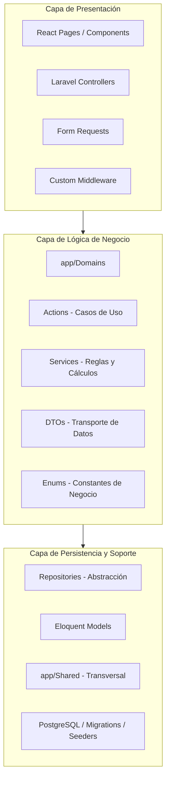

# Contexto del Diagrama de Paquetes de INTELECTA

Este documento define la estructura lógica, las capas arquitectónicas y los paquetes UML oficiales que componen el sistema **INTELECTA**. Su propósito es servir como la única fuente de verdad técnica y visual para reconstruir el **Diagrama de Paquetes** en la fase de estabilización del informe.

---

## 1. Propósito del Diagrama

El Diagrama de Paquetes tiene como objetivo representar la descomposición modular y la organización de los componentes de software de INTELECTA. Muestra la jerarquía de las capas de software, la arquitectura modular orientada a dominios del backend, y las dependencias lógicas entre componentes, permitiendo comprender cómo se aíslan las responsabilidades académicas, operativas e institucionales.

---

## 2. Sistema Representado

*   **Nombre del Sistema:** INTELECTA.
*   **Caso de Estudio:** Academia Universitaria Avalancha (La Paz, Bolivia).
*   **Arquitectura Base:** Laravel 13 (PHP 8.3) en el backend, adoptando un esquema híbrido de controladores HTTP estándar y una lógica de negocio encapsulada por dominios (`app/Domains`), comunicada con un frontend responsive desarrollado en React (Inertia.js + Tailwind CSS) y persistido sobre PostgreSQL y Redis.

---

## 3. Formato Visual de Referencia

Para cumplir con los estándares formales de presentación académica, el diagrama en Draw.io y su exportación PNG deben apegarse a las siguientes pautas visuales:

1.  **Estilo Académico en Blanco y Negro (B&W):**
    *   No utilizar colores llamativos o degradados de color (evitar azules, verdes o rojos saturados).
    *   Usar fondos blancos o escala de grises muy suaves para denotar capas o paquetes específicos.
    *   Líneas y texto completamente en negro o gris oscuro para una legibilidad óptima de impresión.
2.  **Notación UML Estándar de Paquetes:**
    *   Cada paquete debe representarse con la figura clásica de carpeta (un rectángulo principal con una pestaña superior izquierda alineada).
    *   El nombre del paquete debe ubicarse centrado dentro del rectángulo principal.
3.  **Relaciones y Dependencias:**
    *   Las dependencias y relaciones de uso entre paquetes se representan con **flechas de líneas punteadas (dash)** y punta abierta simple.
    *   Las dependencias deben etiquetarse opcionalmente con el estereotipo `<<use>>` o `<<import>>` según corresponda.
    *   Las capas principales se delimitan mediante grandes rectángulos contenedores con bordes finos discontinuos.

---

## 4. Capas Principales y Paquetes UML Oficiales

El sistema se divide en tres niveles o capas de abstracción. Dentro de cada una de ellas se ubican los siguientes paquetes lógicos:

### 4.1 Capa de Presentación
Encargada de capturar las peticiones HTTP del usuario, validar las entradas perimetrales y renderizar la interfaz.
*   **Paquete Frontend (`resources/js/Pages`):** Vistas estructuradas por módulos funcionales (Dashboard, Postulantes, Ficha Académica, Evaluaciones, Reportes, Sistema, etc.).
*   **Paquete Controladores (`app/Http/Controllers`):** Controladores Laravel que actúan como adaptadores de entrada HTTP.
*   **Paquete Validaciones (`app/Http/Requests`):** FormRequests para autorizar y validar sintácticamente los datos de entrada.
*   **Paquete Seguridad Perimetral (`app/Http/Middleware`):** Middlewares de autenticación y acceso administrativo (`EnsureAdministrativeAccess`).

### 4.2 Capa de Lógica de Negocio
Encapsula los procesos de negocio y las reglas académicas de la academia. Se organiza en base a dominios lógicos específicos (`app/Domains`):
*   **Paquete de Casos de Uso (`Actions`):** Una clase por intención o flujo de negocio (ej: `StorePreguntaAction`).
*   **Paquete de Servicios de Dominio (`Services`):** Coordinación de lógicas complejas y cálculos transversales dentro de un mismo dominio (ej: `CoberturaCurricularService`).
*   **Paquete de Datos Tipados (`DTOs`):** Estructuras inmutables para transferir información limpia entre las capas HTTP y el núcleo del sistema.
*   **Paquete de Enumeraciones (`Enums`):** Estados, roles y tipos de negocio estrictamente tipados.

### 4.3 Capa de Persistencia y Soporte
Administra el almacenamiento físico, el acceso de datos y los componentes de soporte globales.
*   **Paquete Abstracción de Datos (`Repositories`):** Contratos e implementaciones para aislar las consultas Eloquent de la lógica de negocio.
*   **Paquete Modelos Eloquent (`Models`):** Modelos de persistencia Eloquent (`Postulante`, `Pregunta`, `Materia`, etc., y el modelo transversal `User`).
*   **Paquete Compartido (`app/Shared`):** Trait, Helper, Contracts y DTOs transversales a todos los dominios que no pertenecen a ninguno en específico.
*   **Paquete Base de Datos (`database/`):** Migraciones DDL para PostgreSQL y seeders (`RolesAndUsersSeeder`).

---

## 5. Dominios Reales del Sistema

Los paquetes que componen la subcapa de lógica de negocio (`app/Domains`) corresponden exactamente a las siguientes carpetas físicas implementadas:

1.  **`Seguridad`:** Gestión de roles y permisos mediante Spatie Permission.
2.  **`Institucional`:** Entidades base del instituto preuniversitario (Programas, Grupos, Asignación de Tutores).
3.  **`Postulantes`:** Administración de expedientes de aspirantes y expediente digital (Ficha Académica).
4.  **`Evaluaciones`:** Estructura curricular (Materia, Área, Tema), Banco de Preguntas y composición de Plantillas de Examen.
5.  **`Resultados`:** Consolidación de respuestas y rendimientos de simulacros.
6.  **`Reportes`:** Generación de información resumida y analítica descriptiva.
7.  **`LearningAnalytics`:** Indicadores y recomendaciones conceptuales de riesgo académico.
8.  **`Academico`:** Control de asistencia, habilitaciones de simulacros, cobro de matrículas y control de cuotas.

---

## 6. Módulos que Deben Figurar en la Presentación del Diagrama

Para que el diagrama tenga coherencia total con el mapa navegacional y el sidebar del sistema actual, deben aparecer de manera explícita los siguientes 12 módulos funcionales dentro de la estructura de paquetes:
*   Seguridad, usuarios y dashboard
*   Gestión institucional (programas, grupos y paralelos)
*   Gestión de postulantes (incluyendo Ficha Académica)
*   Gestión evaluativa (materias, áreas de conocimiento y temas)
*   Banco de preguntas
*   Plantillas de evaluación
*   Aplicación de evaluaciones (restringido a portal de postulante)
*   Resultados académicos
*   Reportes académicos
*   Indicadores de desempeño
*   Learning Analytics (propuesta conceptual)
*   Roles y permisos (Spatie)

---

## 7. Términos y Conceptos que NO Deben Aparecer

Queda prohibida la inclusión de los siguientes términos obsoletos, erróneos o ajenos al proyecto:
*   ❌ **Docente** (Reemplazado en toda la documentación técnica por **Tutor Académico**).
*   ❌ **Estudiante** (Reemplazado en la jerga preuniversitaria por **Postulante**).
*   ❌ **Retos / Gamificación** (Término desestimado del MVP).
*   ❌ **Casa Amandita** (Caso de estudio desestimado).
*   ❌ **Colegio San Antonio de Padua** (Referencia a datos maestros no autorizados).

---

## 8. Justificación Técnica Breve

La arquitectura por dominios modular (`app/Domains`) en Laravel 13 separa la persistencia HTTP de la lógica pura de negocio. Al aislar cada módulo académico (como Evaluaciones o Postulantes) en un paquete cohesivo de dominio independiente, se eliminan dependencias circulares complejas, facilitando el desarrollo y garantizando que cambios en el banco de preguntas no alteren silenciosamente el cobro de matrículas o el control de asistencia. El desacoplamiento entre controladores del Http y las Actions simplifica las pruebas unitarias y garantiza una base mantenible.

---

## 9. Entregables Esperados

Al finalizar la diagramación física en el siguiente bloque, se deberán generar e integrar a la documentación los siguientes recursos:
1.  **`docs/03-diagramas/drawio/diagrama-paquetes-intelecta.drawio`:** Archivo fuente editable estructurado por capas y paquetes UML.
2.  **`docs/03-diagramas/imagenes-exportadas/diagrama-paquetes-intelecta.png`:** Exportación a alta resolución en blanco y negro para ser incrustado en el informe académico.
